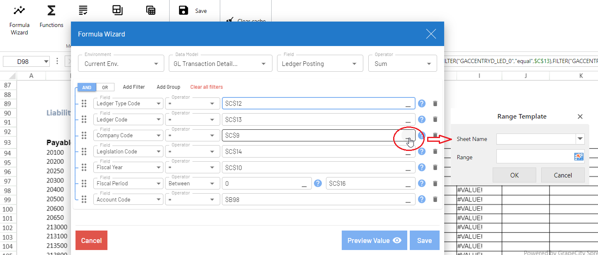
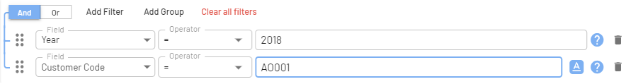
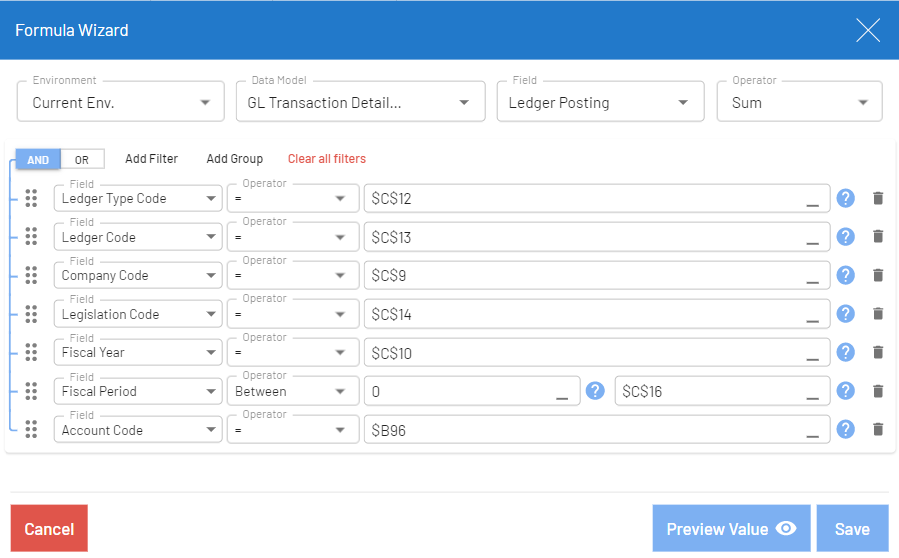
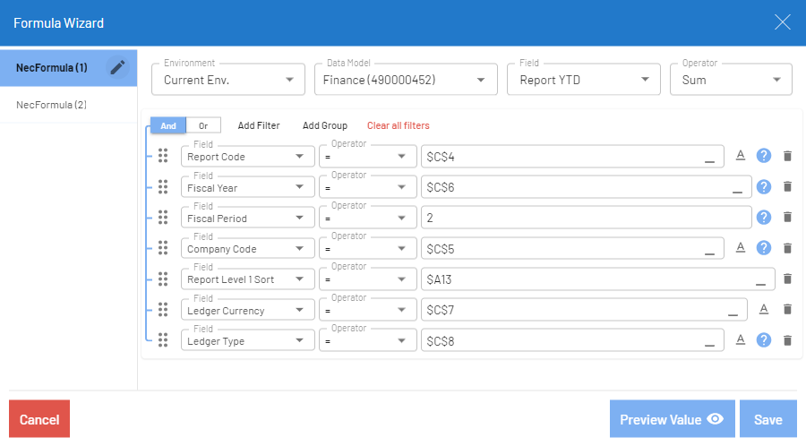
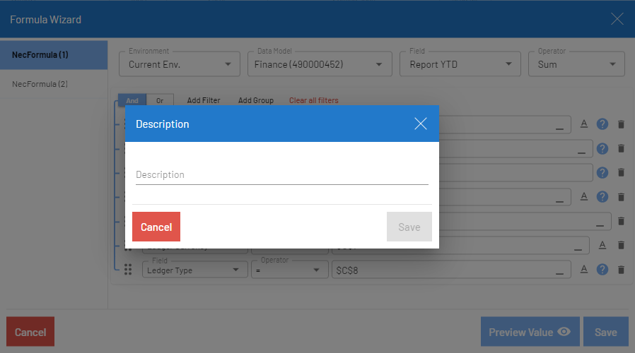
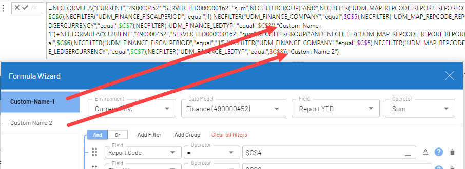
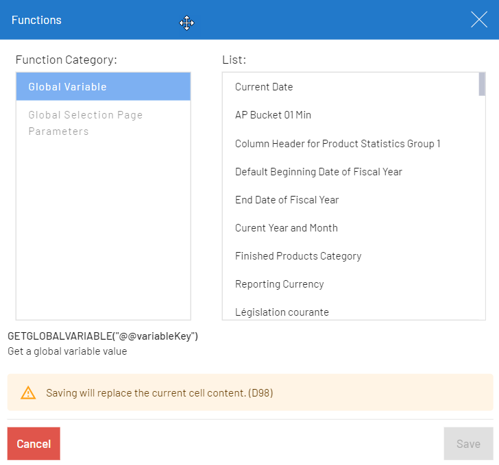
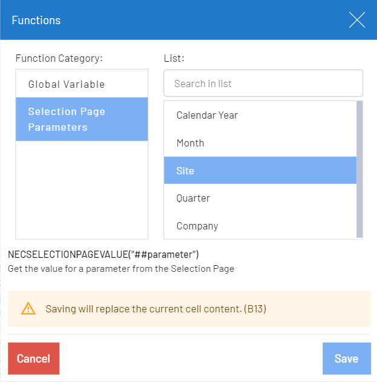

# Customizing a Workbook  

To customize a workbook:

1. To insert a formula, click __Formula Wizard__ from the _Analysis_ tab.

    1. Select the __Environment__ from the drop-down list. All available environments in Web Client are listed. When set as __Current Env.__, it will update the formula to retrieve the data of the environment selected.

        !!! note
            When you switch environments from the title bar, the data will be updated automatically everywhere EXCEPT for formulas created in specific environments.  

    2. Select the __Data Model__, __Field__ and __Operator__ from their respective drop-down lists. You can also search the item by typing the name in the field for a quicker selection.

    1. Click __Add Filter__ to add filters to the formula. Filters can be grouped using __Add Group__ and can be set between an OR and AND. For formula examples, see [Workbook Formula Examples](https://onlinehelp.sageenterpriseintelligence.com/Latest/en/Web-Interface/Workbook/workbook-examples.htm).

        * Select the field, operator and value. The value can also be a referenced cell. You can use the prompt  to select the field.

        * If you wish to reference a cell, click the underscore in the Value field and select the cell. You can also enter the value in the cell.

        { width=200px }

        * When you enter a character value, the workbook assumes that it is a cell reference by default. To specify the value as text, click the  icon; its color then changes to blue .

        { width=200px }

        !!! note
            When selecting a character value using the prompt, the value is set to text automatically.

    2. You can click __Preview Value__ to preview the formula result. If the formula is incorrect, a message will be displayed. When resolving the formula, a timeout happens when the querying reaches 300 seconds (5 minutes) or if the data results retrieved for the formula reaches 500,000.

    2. Click __Save__.

        { width=200px }

    The workbook generates a function that is visible in the formula bar. When clicking the formula bar, it displays a pop-up that shows the NECFORMULA function (similar to the NECACCESS function in the Excel Add-in).

    { width=200px }

    !!! note
        As opposed to Excel Add-in, you do not need to create a reference configuration. This is done automatically according to the created formula thanks to smart caching.

2. When using more than one NECFORMULA within a cell, the Formula Wizard gives the ability to give a name to each formula. { start=4 }

    1. Select a cell with multiple NECFORMULA, then click __Formula Wizard__ from the Analysis tab.

    1. In the list on the left, click the  to rename the NECFORMULA of your choice.

        { width=200px }
        { width=200px }

    1. Once you save the changes, the custom names are added to the NECFORMULA in the cell.

        { width=200px }

    !!! note
        This feature only appears when there are multiple formulas within a single cell.

3. If you wish to use a global variable or a global selection page variable, click __Functions__ from the _Analysis_ tab.

    1. Select a variable from the Global Variable or Global Selection Page Parameters list.

    1. Click __Save__. That variable can then be used in a formula if its cell is referenced.

        { width=100px }
        { width=100px }

    !!! note
        Global variables use @@ in front of the parameter. Selection Pages use ## in front of the parameter. Reports can use both types of parameters (## and @@). To view a selection page example, click here.

4. When finished, click Save to keep the workbook changes.

    !!! example  
        { width=200px }
